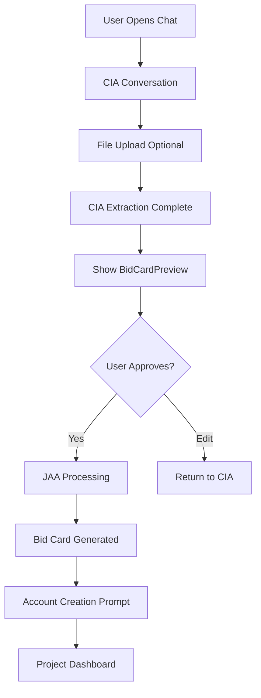

# Agent 1: Build Priorities & Action Plan
**Purpose**: Consolidated build plan for CIA + JAA agents and frontend connections  
**Last Updated**: January 30, 2025  
**Scope**: Customer Interface Agent, Job Assessment Agent, Frontend Chat/BidCard systems

## 🎯 **AGENT 1 DOMAIN OVERVIEW**

**My Responsibility**:
- **CIA Agent** (Customer Interface) - LangGraph backend agent for homeowner conversations
- **JAA Agent** (Job Assessment) - LangGraph backend agent for bid card generation  
- **Frontend Connections** - React components that interface with these agents

**Current Status**: ✅ Both agents working, frontend connections operational

---

## 🚨 **IMMEDIATE PRIORITIES**

### **1. Mobile Chat Interface** 🔴 **CRITICAL**
**Status**: ❌ BROKEN - Desktop-only experience  
**Business Impact**: Contractors often mobile-first, users expect mobile functionality  
**Timeline**: This session

**Components Needed**:
```tsx
// Mobile-responsive chat improvements
web/src/components/chat/CIAChat.tsx:
- Fix fixed-width layout breaking on mobile
- Touch-friendly input and send button
- Mobile viewport optimization
- Camera access for file upload

// New mobile navigation
web/src/components/common/MobileNav.tsx:
- Bottom tab navigation or hamburger menu
- Touch targets >44px for accessibility
```

**Technical Tasks**:
- [ ] Update CIAChat.tsx with responsive breakpoints
- [ ] Add mobile viewport meta tag if missing
- [ ] Test touch interactions on real devices
- [ ] Implement camera access for mobile file uploads

### **2. Bid Card Preview System** 🟡 **HIGH** 
**Status**: ❌ MISSING - Users can't review before submission  
**Business Impact**: Users should see extracted information before contractor outreach  
**Timeline**: Next session

**Component Needed**:
```tsx
// New preview component
web/src/components/bidcard/BidCardPreview.tsx:
- Display extracted project information  
- Allow editing before JAA submission
- Show InstaBids value propositions
- Clear "Looks good" vs "Need changes" actions
```

**Integration Points**:
- CIA conversation completion → Show preview
- Preview approval → JAA processing
- Preview editing → Return to CIA for clarification

### **3. Account Creation Flow** 🟡 **HIGH**
**Status**: 🚧 BASIC STRUCTURE - No CIA integration  
**Business Impact**: Seamless signup required for project persistence  
**Timeline**: Next session

**Current Gap**:
- Basic login/signup pages exist ✅
- No integration with CIA conversation flow ❌
- Missing "continue as guest" vs "create account" flow ❌
- No persistent conversation across login ❌

**Components to Build**:
```tsx
web/src/components/auth/:
├── GuestModePrompt.tsx     # Continue as guest option
├── SignupInChat.tsx        # Inline signup during chat
└── ConversationRestore.tsx # Restore chat after login
```

---

## 📊 **CIA AGENT STATUS & ENHANCEMENTS**

### **✅ WORKING SYSTEMS**
- **Claude Opus 4 Integration**: Real API calls working perfectly ✅
- **Intelligent Extraction**: 12+ data points from natural language ✅
- **Conversation State**: Persistence and memory working ✅
- **File Upload**: Image analysis and storage ✅
- **InstaBids Messaging**: Value props clearly communicated ✅
- **Multi-Project Memory**: Cross-project awareness ✅

### **🚧 ENHANCEMENT OPPORTUNITIES**

#### **Conversation Quality Improvements**
```python
# ai-agents/agents/cia/prompts.py enhancements:
- Add project type specialization (kitchen vs lawn vs roofing)
- Improve budget range extraction accuracy
- Better timeline/urgency detection
- Enhanced photo analysis prompts
```

#### **Error Handling & Recovery**
```python
# ai-agents/agents/cia/agent.py improvements:
- Graceful API failure handling
- Conversation state recovery
- Better validation of extracted data
- Retry logic for Claude API calls
```

#### **Mobile-Specific Conversation Flow**
- Shorter message chunks for mobile reading
- Touch-optimized file upload prompts  
- Voice input integration (future)
- Quick response buttons for common answers

---

## 📊 **JAA AGENT STATUS & ENHANCEMENTS**

### **✅ WORKING SYSTEMS**  
- **Database Integration**: Conversation retrieval working ✅
- **Bid Card Generation**: Professional output format ✅
- **Data Extraction**: 12 key data points extracted ✅
- **Database Persistence**: Bid cards saved correctly ✅

### **🚧 ENHANCEMENT OPPORTUNITIES**

#### **Extraction Accuracy Improvements**
```python
# ai-agents/agents/jaa/agent.py enhancements:
- Better budget range parsing ("around 25k" vs "$500-800")
- Improved timeline extraction (natural language → dates)
- Enhanced location parsing (various address formats)
- Project complexity scoring refinement
```

#### **Bid Card Quality Enhancements**
```python
# Enhanced bid card structure:
- Project-specific templates (lawn vs kitchen vs roofing)
- Photo analysis integration for better descriptions
- Contractor guidance customization by project type
- Pricing guidance based on regional data
```

#### **Validation & Quality Control**
- Pre-submission validation of extracted data
- Confidence scoring for each extracted field
- Human review flags for complex projects
- A/B testing of different extraction approaches

---

## 🎨 **FRONTEND COMPONENTS STATUS**

### **✅ WORKING COMPONENTS**

#### **CIAChat.tsx** - Main Chat Interface
**Status**: ✅ Desktop Working, ❌ Mobile Broken  
**Location**: `web/src/components/chat/CIAChat.tsx`  
**Capabilities**:
- Real-time chat with CIA agent ✅
- File upload integration ✅  
- Message persistence ✅
- InstaBids value prop messaging ✅

**Mobile Issues**:
- Fixed width layout breaks on small screens ❌
- Touch targets too small ❌
- File upload doesn't support camera ❌
- Viewport optimization missing ❌

#### **BidCard.tsx** - Bid Card Display System
**Status**: ✅ EXCELLENT - All variants working  
**Location**: `frontend/src/components/BidCard.tsx`  
**Capabilities**:
- 3 variants: full (web), preview (list), email (HTML-safe) ✅
- Professional photo gallery with navigation ✅
- Mobile responsive design ✅
- Rich link preview support for contractor outreach ✅

### **❌ MISSING COMPONENTS**

#### **BidCardPreview.tsx** - User Review System
**Purpose**: Allow users to review and edit extracted information  
**Priority**: HIGH - Users need to verify accuracy before outreach

```tsx
interface BidCardPreviewProps {
  extractedData: ExtractedProjectData;
  onApprove: () => void;
  onEdit: (field: string, value: any) => void;
  onReject: () => void;
}

// Features needed:
- Editable fields for all extracted data
- Real-time preview of final bid card
- Confidence indicators for each field
- Clear approval workflow
```

#### **MobileNav.tsx** - Mobile Navigation
**Purpose**: Touch-friendly navigation for mobile users  
**Priority**: CRITICAL - Mobile experience completely broken

```tsx
// Mobile navigation options:
Option 1: Bottom tab navigation (app-like)
Option 2: Hamburger menu (traditional)
Option 3: Hybrid approach (context-aware)

// Required features:
- Touch targets >44px
- Thumb-friendly positioning
- Clear visual hierarchy
- Fast switching between chat and bid cards
```

---

## 🧪 **TESTING STRATEGY FOR AGENT 1**

### **Current Testing Status**
- **Backend Agents**: ✅ Comprehensive testing via `test_cia_claude_extraction.py`
- **Frontend Components**: ❌ Zero test coverage (clean slate approach)
- **Integration**: ✅ Manual testing working
- **Mobile**: ❌ Not tested

### **Testing Approach**: Quality Over Quantity
**Philosophy**: Write tests when features are stable, not upfront

#### **When to Add Tests**:
1. **CIAChat Mobile**: After mobile redesign complete
2. **BidCardPreview**: After component built and working  
3. **Account Creation**: After integration with CIA flow
4. **Error Scenarios**: After core functionality stable

#### **Test Types by Priority**:
```typescript
// 1. Component Tests (when component is complex):
CIAChat.test.tsx - User interactions, mobile behavior
BidCardPreview.test.tsx - Editing workflow, validation

// 2. Integration Tests (when features connect):
CIA ↔ Backend API calls
File upload ↔ Storage integration  
Account creation ↔ Conversation persistence

// 3. E2E Tests (when critical paths exist):
Complete conversation → bid card → account creation flow
Mobile conversation experience
Cross-device compatibility
```

---

## 📱 **MOBILE DEVELOPMENT STRATEGY**

### **Current Mobile Status**: 25% Complete

| Component | Desktop | Mobile | Action Needed |
|-----------|---------|--------|---------------|
| CIAChat | ✅ Excellent | ❌ Broken | Responsive redesign |
| BidCard | ✅ Excellent | ✅ Working | Minor optimizations |
| Navigation | ✅ Good | ❌ Poor | Mobile nav component |
| File Upload | ✅ Working | ❌ No camera | Camera integration |

### **Mobile-First Development Approach**

#### **Phase 1: Critical Fixes** (This Session)
1. **CIAChat Responsive**: Fix layout breakpoints
2. **Touch Targets**: Ensure >44px buttons
3. **Viewport Meta**: Proper mobile viewport
4. **File Upload**: Add camera access

#### **Phase 2: Mobile Experience** (Next Session)  
1. **Mobile Navigation**: Bottom tabs or hamburger
2. **Touch Gestures**: Swipe, pinch, long press
3. **Performance**: Optimize for mobile networks
4. **PWA Features**: Offline support, install prompt

#### **Phase 3: Advanced Mobile** (Future)
1. **Voice Input**: Speech-to-text for conversations
2. **Camera AI**: Real-time project analysis
3. **Location Services**: Auto-detect project location
4. **Push Notifications**: Project updates

---

## 🔄 **WORKFLOW INTEGRATION**

### **CIA → JAA → Frontend Flow**



### **Error Handling Strategy**

```typescript
// CIA Agent Error Scenarios:
- Claude API timeout → Retry with exponential backoff
- File upload failure → Alternative upload method
- Extraction incomplete → Request clarification

// JAA Agent Error Scenarios:  
- Database connection → Queue for retry
- Invalid data format → Request CIA re-extraction
- Generation failure → Human review flag

// Frontend Error Scenarios:
- API connection lost → Offline mode with sync
- Mobile viewport issues → Fallback layout
- Touch interaction failures → Alternative controls
```

---

## 📋 **IMPLEMENTATION TIMELINE**

### **This Session (January 30, 2025)**
1. **Mobile CIAChat Fix** - Responsive layout and touch targets
2. **Camera Integration** - File upload with camera access
3. **Viewport Optimization** - Proper mobile meta tags
4. **Basic Error Handling** - Graceful API failure modes

### **Next Session**
1. **BidCardPreview Component** - User review and editing system
2. **Mobile Navigation** - Touch-friendly navigation component
3. **Account Creation Integration** - Seamless signup in chat flow
4. **Performance Optimization** - Mobile network optimization

### **Future Sessions**
1. **Advanced Mobile Features** - Voice input, PWA capabilities
2. **Enhanced Error Recovery** - Comprehensive error handling
3. **A/B Testing Framework** - Conversation flow optimization
4. **Analytics Integration** - User behavior tracking

---

## 🎯 **SUCCESS METRICS FOR AGENT 1**

### **Technical Metrics**
- **CIA Extraction Accuracy**: >95% (currently ✅ achieved)
- **JAA Bid Card Generation**: 100% success rate (currently ✅ achieved)  
- **Mobile Usability**: >90% mobile users successfully complete conversations
- **File Upload Success**: >95% success rate across devices
- **Account Creation Conversion**: >70% from chat to account

### **User Experience Metrics**
- **Mobile Completion Rate**: Target >80% mobile conversation completion
- **Time to Bid Card**: <5 minutes average conversation time
- **User Satisfaction**: >4.5/5 rating for conversation experience
- **Error Recovery**: <5% conversations lost due to errors

### **Business Impact Metrics**
- **Conversation → Bid Card**: >90% conversion rate
- **Mobile Traffic**: Growing % of mobile users
- **User Retention**: % returning for additional projects
- **Support Tickets**: <1% conversations requiring human intervention

---

## 💡 **TECHNICAL IMPLEMENTATION NOTES**

### **Mobile Development Best Practices**
```tsx
// Responsive Design Pattern:
const useIsMobile = () => {
  const [isMobile, setIsMobile] = useState(false);
  
  useEffect(() => {
    const checkDevice = () => {
      setIsMobile(window.innerWidth < 768);
    };
    
    checkDevice();
    window.addEventListener('resize', checkDevice);
    return () => window.removeEventListener('resize', checkDevice);
  }, []);
  
  return isMobile;
};

// Touch-friendly components:
- Minimum 44px touch targets
- Generous padding between interactive elements
- Clear visual feedback for touches
- Swipe gestures for navigation
```

### **Error Handling Patterns**
```typescript
// CIA Agent Error Boundary:
class CIAErrorBoundary extends React.Component {
  handleRetry = () => {
    // Attempt to restore conversation state
    // Retry last CIA operation
    // Provide alternative input methods
  };
  
  render() {
    if (this.state.hasError) {
      return <RetryInterface onRetry={this.handleRetry} />;
    }
    return this.props.children;
  }
}
```

### **Performance Optimization**
```typescript
// Conversation state optimization:
- Debounced message sending
- Local state caching
- Progressive loading of conversation history
- Image compression before upload
- Lazy loading of bid card components
```

---

## 🔧 **COORDINATION WITH OTHER AGENTS**

### **Agent 2 Dependencies (Backend)**
- **WFA Integration**: Need bid cards from JAA for website form automation
- **API Consistency**: Coordinate endpoint formats and error codes
- **Database Schema**: Shared tables (conversations, bid_cards)

### **Agent 3 Dependencies (Homeowner UX)**
- **Design System**: Consistent UI components and patterns
- **Navigation**: Coordinate mobile navigation patterns
- **User State**: Seamless transition between chat and dashboard

### **Shared Infrastructure**
- **Authentication**: Consistent auth flow across all components
- **Error Handling**: Standardized error messages and recovery
- **Performance**: Shared optimization strategies

---

**🎯 Current Focus: Mobile experience is the #1 priority for Agent 1 domain. Desktop functionality is solid, but mobile users are completely blocked.**

**Next Action: Fix CIAChat.tsx mobile responsive layout and touch interactions.**