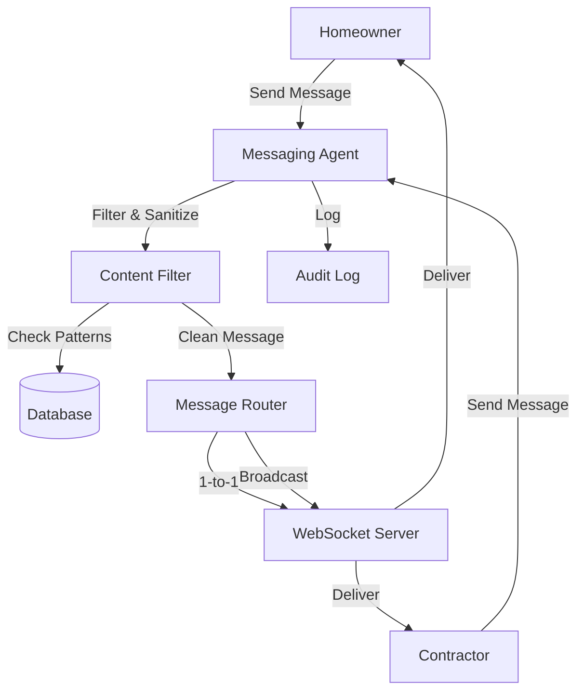

# InstaBids Messaging System - Comprehensive Build Plan

## Overview
The messaging system is a critical component that enables secure communication between homeowners and contractors while protecting contact information. This system will be built as a separate messaging agent that sits between all parties to ensure compliance with business rules.

## Core Business Requirements

### 1. **Identity Protection** (CRITICAL)
- **NO CONTACT INFORMATION** can be passed between homeowners and contractors
- Contractors appear as "Contractor A", "Contractor B", etc.
- All messages must be screened for phone numbers, emails, addresses
- Payment only occurs AFTER contractor selection

### 2. **Communication Patterns**
- **1-to-1**: Homeowner ↔ Individual Contractor
- **1-to-Many**: Homeowner → All Contractors (broadcast updates)
- **Bid-Connected**: Messages tied to specific bid submissions
- **Max Contractors**: 5-8 contractors per bid card

### 3. **Message Types**
- Text messages
- Image attachments (project photos)
- Documents (plans, permits, etc.)
- System notifications (bid updates, status changes)
- Automated responses

## System Architecture

### 1. **Messaging Agent (New LangGraph Agent)**
```python
# Core responsibilities:
- Message filtering and sanitization
- Contact info detection and blocking
- Message routing and delivery
- Conversation state management
- Notification orchestration
```

### 2. **Database Schema Extensions**

#### bid_card_conversations
```sql
CREATE TABLE bid_card_conversations (
  id UUID PRIMARY KEY DEFAULT gen_random_uuid(),
  bid_card_id UUID NOT NULL REFERENCES bid_cards(id),
  homeowner_id UUID NOT NULL,
  contractor_id UUID NOT NULL,
  contractor_alias VARCHAR(50) NOT NULL, -- "Contractor A", "Contractor B"
  status VARCHAR(20) DEFAULT 'active', -- active, archived, blocked
  created_at TIMESTAMP DEFAULT NOW(),
  last_activity TIMESTAMP DEFAULT NOW(),
  unread_homeowner_count INT DEFAULT 0,
  unread_contractor_count INT DEFAULT 0,
  metadata JSONB DEFAULT '{}'
);
```

#### message_content_filters
```sql
CREATE TABLE message_content_filters (
  id UUID PRIMARY KEY DEFAULT gen_random_uuid(),
  pattern TEXT NOT NULL,
  pattern_type VARCHAR(20), -- regex, keyword, ai_detected
  action VARCHAR(20), -- block, flag, sanitize
  description TEXT,
  created_at TIMESTAMP DEFAULT NOW()
);
```

#### message_audit_log
```sql
CREATE TABLE message_audit_log (
  id UUID PRIMARY KEY DEFAULT gen_random_uuid(),
  message_id UUID REFERENCES bid_card_messages(id),
  original_content TEXT,
  sanitized_content TEXT,
  blocked_patterns TEXT[],
  ai_review_notes TEXT,
  reviewed_at TIMESTAMP DEFAULT NOW()
);
```

### 3. **WebSocket Architecture**

#### Connection Management
```typescript
interface WebSocketConnection {
  userId: string;
  userType: 'homeowner' | 'contractor';
  activeBidCards: string[];
  socket: WebSocket;
}

interface MessageEvent {
  type: 'message' | 'typing' | 'read' | 'broadcast';
  bidCardId: string;
  conversationId: string;
  data: any;
}
```

#### Real-time Events
- `message:new` - New message received
- `message:read` - Message marked as read
- `typing:start` / `typing:stop` - Typing indicators
- `bid:update` - Bid status changed
- `broadcast:update` - Homeowner broadcast message

### 4. **Frontend Components**

#### MessageCenter
```typescript
// Main messaging interface
interface MessageCenterProps {
  bidCardId: string;
  userType: 'homeowner' | 'contractor';
}

// Features:
- Conversation list (contractors for homeowner, single for contractor)
- Active chat window
- Message input with file attachment
- Typing indicators
- Unread badges
- Broadcast option (homeowner only)
```

#### ConversationThread
```typescript
// Individual conversation display
interface ConversationThreadProps {
  conversationId: string;
  recipientAlias: string; // "Contractor A" or "Homeowner"
  messages: Message[];
  onSendMessage: (content: string, attachments?: File[]) => void;
}
```

#### MessageComposer
```typescript
// Rich message input
interface MessageComposerProps {
  onSend: (content: string, attachments?: File[]) => void;
  allowAttachments: boolean;
  broadcastMode?: boolean;
}
```

### 5. **Message Flow Architecture**



## Implementation Phases

### Phase 1: Core Messaging Infrastructure (Week 1)
1. **Database Setup**
   - Create new tables
   - Set up message filtering patterns
   - Initialize contractor aliasing system

2. **Messaging Agent (LangGraph)**
   - Content filtering node
   - Message routing node
   - Notification node
   - State management

3. **Basic API Endpoints**
   - Send message
   - Get conversations
   - Mark as read
   - Get message history

### Phase 2: Real-time WebSocket Layer (Week 2)
1. **WebSocket Server**
   - Connection management
   - Room-based messaging
   - Event broadcasting
   - Reconnection logic

2. **Frontend Integration**
   - WebSocket hook
   - Connection state management
   - Message queue for offline
   - Optimistic updates

3. **Typing Indicators**
   - Debounced typing events
   - Timeout management
   - UI indicators

### Phase 3: Advanced Features (Week 3)
1. **Content Filtering AI**
   - Phone number detection
   - Email detection
   - Address detection
   - Social media handles
   - Custom business rules

2. **File Attachments**
   - Image upload/compression
   - Document handling
   - Preview generation
   - Virus scanning

3. **Broadcast Messaging**
   - Homeowner broadcast UI
   - Delivery confirmation
   - Read receipts

### Phase 4: Polish & Integration (Week 4)
1. **Notifications**
   - Push notifications
   - Email digests
   - SMS alerts (optional)
   - In-app badges

2. **Message Search**
   - Full-text search
   - Filter by date/contractor
   - Attachment search

3. **Analytics**
   - Response times
   - Message volumes
   - Engagement metrics

## API Endpoints

### Core Messaging
```
POST   /api/messaging/send
GET    /api/messaging/conversations/{bidCardId}
GET    /api/messaging/messages/{conversationId}
PUT    /api/messaging/messages/{messageId}/read
POST   /api/messaging/broadcast/{bidCardId}
```

### WebSocket Events
```
ws://localhost:8008/ws/messaging

Events:
- connection:init
- message:send
- message:receive
- typing:update
- conversation:update
```

## Security Measures

### 1. **Content Filtering Rules**
```javascript
const BLOCKED_PATTERNS = [
  /\b\d{3}[-.]?\d{3}[-.]?\d{4}\b/g, // Phone numbers
  /\b[A-Za-z0-9._%+-]+@[A-Za-z0-9.-]+\.[A-Z|a-z]{2,}\b/g, // Emails
  /\b\d+\s+[\w\s]+(?:street|st|avenue|ave|road|rd|boulevard|blvd|lane|ln|drive|dr|court|ct|plaza|pl)\b/gi, // Addresses
  /@[A-Za-z0-9_]+/g, // Social handles
  /(?:https?:\/\/)?(?:www\.)?(?:facebook|fb|instagram|ig|twitter|linkedin)\.com\/[\w\.\-]+/gi // Social URLs
];
```

### 2. **Message Sanitization**
- Replace detected patterns with [BLOCKED]
- Log original in audit table
- Flag for manual review if needed

### 3. **Rate Limiting**
- Max 100 messages per hour per user
- Max 10 attachments per hour
- Broadcast limited to 1 per hour

## Integration Points

### With Bid Card System
- Messages linked to bid_card_id
- Conversation starts when bid submitted
- Archives when bid accepted/rejected

### With Authentication
- User verification for all messages
- Role-based access (homeowner vs contractor)

### With Notification System
- Trigger notifications on new messages
- Batch notifications for broadcasts
- Preference management

## Success Metrics
- Zero contact information leaks
- < 100ms message delivery time
- 99.9% uptime for WebSocket connections
- < 5% false positive rate on content filtering

## Technical Stack
- **Backend**: FastAPI + WebSockets
- **Messaging Agent**: LangGraph with Claude
- **Frontend**: React + react-use-websocket
- **Database**: PostgreSQL (Supabase)
- **Cache**: Redis for presence/typing
- **File Storage**: Supabase Storage

## Next Steps
1. Review and approve this plan
2. Set up messaging agent in LangGraph
3. Create database migrations
4. Build WebSocket infrastructure
5. Implement frontend components
6. Test content filtering extensively